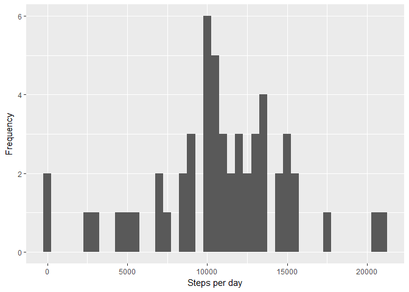
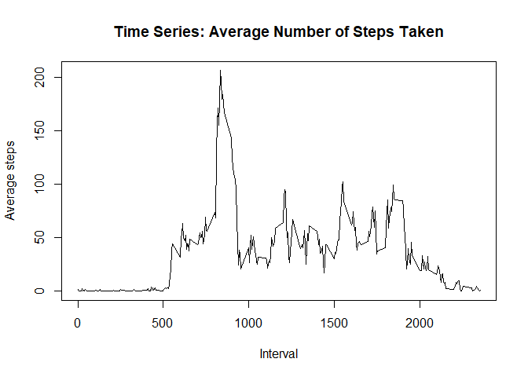
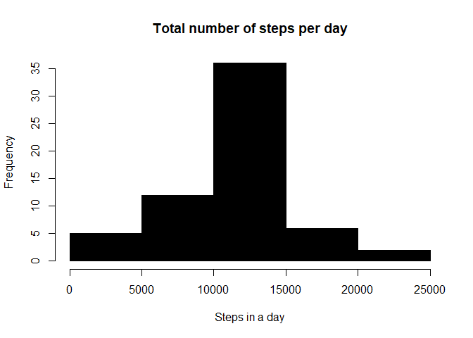
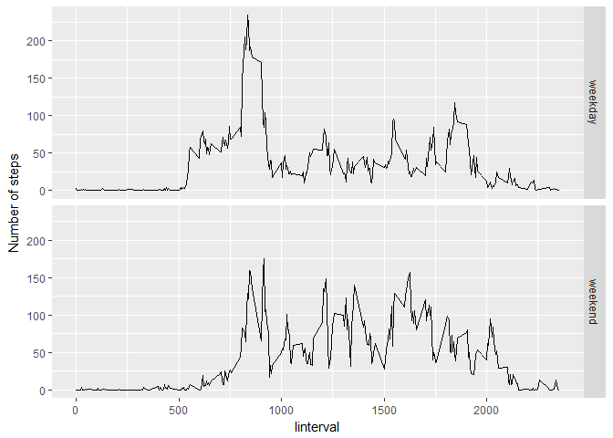

##Purpose
##=======
This assignment will be described in multiple parts. You will need to write a report that
answers the questions detailed below. Ultimately, you will need to complete the entire
assignment in a single R markdown document that can be processed by knitr and be transformed
into an HTML file.


##First task
## Loading and preprocessing the data
Just load the data file


```r
#Load required librarys
library(ggplot2)
if(!file.exists('activity.csv')){
    unzip('activity.zip')
}
stepdata <- read.csv("./activity.csv")

#have a look at the data
head(stepdata)
```

```
##   steps       date interval
## 1    NA 2012-10-01        0
## 2    NA 2012-10-01        5
## 3    NA 2012-10-01       10
## 4    NA 2012-10-01       15
## 5    NA 2012-10-01       20
## 6    NA 2012-10-01       25
```

```r
#correct the date
stepdata$date <- as.Date(stepdata$date, format = "%Y-%m-%d")
```

##Second task
## What is mean total number of steps taken per day?
1. Calculate the total number of steps taken per day


```r
tsteps <- aggregate(steps ~ date, data = stepdata, sum, na.rm = TRUE)
head(tsteps)
```

```
##         date steps
## 1 2012-10-02   126
## 2 2012-10-03 11352
## 3 2012-10-04 12116
## 4 2012-10-05 13294
## 5 2012-10-06 15420
## 6 2012-10-07 11015
```

2. If you do not understand the difference between a histogram and a barplot, research the difference between them. Make a histogram of the total number of steps taken each day

```r
qplot(tsteps$steps, xlab='Steps per day', ylab='Frequency', binwidth = 500)
```

<!-- -->

3. Calculate and report the mean and median of the total number of steps taken per day

```r
mean(tsteps$steps)
```

```
## [1] 10766.19
```

```r
median(tsteps$steps)
```

```
## [1] 10765
```

## What is the average daily activity pattern?
New aggregate based on mean
1. Make a time series plot

```r
avsteps <- aggregate(steps ~ interval, data = stepdata, mean, na.rm = TRUE)
plot(avsteps$interval, avsteps$steps, type = "l", 
     main = "Time Series: Average Number of Steps Taken", 
     xlab = "Interval", ylab = "Average steps")
```

<!-- -->

2. Which 5-minute interval, on average across all the days in the dataset, contains the maximum number of steps?

```r
#get the interval with most steps
maxsteps <- avsteps$interval[which.max(avsteps$steps)]
```
- Interval with most steps is 835

##Third task
## Imputing missing values
1. Calculate and report the total number of missing values in the dataset (i.e. the total number of rows with NAs)

```r
numNAs <- sum(is.na(stepdata))
```
- There are a total of 2304 rows with missing data

2. Devise a strategy for filling in all of the missing values in the dataset. The strategy does not need to be sophisticated. For example, you could use the mean/median for that day, or the mean for that 5-minute interval, etc.

```r
#Use the intervals average to replace NA's
#Create a copy

newData <- stepdata
for(i in 1:nrow(newData)){
  if (is.na(newData[i,1])){
    
    intervalx <- newData[i,3]
    intervalavg <- which(avsteps$interval == intervalx)
    newData[i,1] = avsteps[intervalavg, 2]
  }
}
```
4. Make a histogram of the total number of steps taken each day and Calculate and report the mean and median total number of steps taken per day. Do these values differ from the estimates from the first part of the assignment? What is the impact of imputing missing data on the estimates of the total daily number of steps?

#create a histogram

```r
newnewData <- aggregate(steps ~ date, data = newData, sum, na.rm = TRUE)
hist(newnewData$steps, col=1,main="Total number of steps per day", 
      xlab="Steps in a day")
```

<!-- -->

```r
mean(newnewData$steps)
```

```
## [1] 10766.19
```

```r
median(newnewData$steps)
```

```
## [1] 10766.19
```
- Mean has stayed the same but Median has changed die to use of average values


## Are there differences in activity patterns between weekdays and weekends?


```r
#add a new column with the day
stepdata$day <- weekdays(stepdata$date)

#add a new column with the type of day - default to weekday
stepdata$daytype <- c("weekday")

#loopp through and change any Saturday Sunday to weekend
for (i in 1:nrow(stepdata)){
  if (stepdata$day[i] == "Saturday" | stepdata$day[i] == "Sunday"){
    stepdata$daytype[i] <- "weekend"
  }
}

#make it into a factor
stepdata$daytype <- as.factor(stepdata$daytype)

# aggregate into intervals
newagg <- aggregate(steps ~ interval+daytype, data = stepdata, mean, na.rm = TRUE)

#plot the data
ggplot(newagg, aes(interval, steps)) + 
    geom_line() + 
    facet_grid(daytype ~ .) +
    xlab("Iinterval") + 
    ylab("Number of steps")
```

<!-- -->


